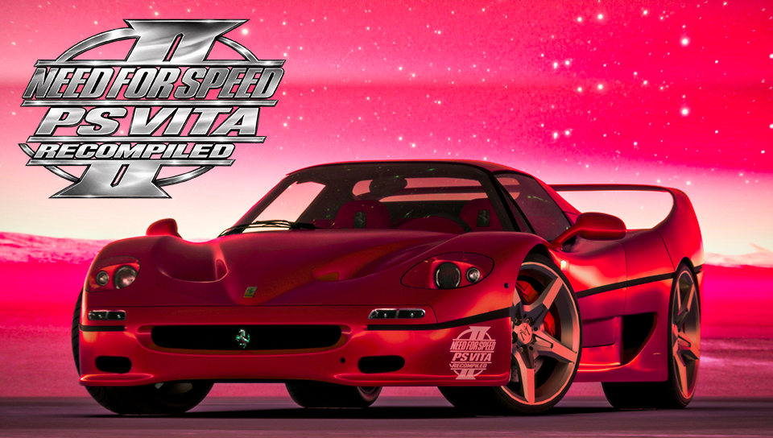

# NFS II SE Recompiled — PS Vita

**Version 1.00 - First public release** · Part of **Classic NFS Saga for PS Vita**

A PS Vita adaptation of Need for Speed II: Special Edition, based on zaps166's NFSIISE wrapper and ARM-compatible C++ core. Original Glide rendering is handled through vitaGL with native Cg shaders. This is an unofficial community port, not a new game engine written from scratch.



## Current status

Single-player gameplay, menus, sound, launcher and classic/modern controls have been tested on a real PS Vita. Installation of the final version 1.00 package and its custom bubble/LiveArea artwork were confirmed by the tester on September 22, 2026.

Performance varies with the scene: the tester reported approximately **15–50 FPS**. Stable 40 or 60 FPS is **not** a release guarantee. Further renderer batching and frame-time work are planned. See [release notes](RELEASE_NOTES.md).

## Screenshots

<p align="center">
  
  
</p>

<p align="center">
  
  
</p>

<p align="center">
  
  
</p>

<p align="center">
  
  
</p>

## About AI Usage

This project was developed with **limited AI assistance**.

I have a general understanding of programming, software architecture, debugging, build systems, and the code being modified throughout this port. AI tools were primarily used as a way to **scan large portions of the codebase, identify possible problem areas, compare implementations, and accelerate repetitive debugging tasks**.

In practice, AI helped reduce the time required to locate issues that would otherwise require manually searching through thousands of lines of code. Proposed changes were still reviewed, tested, adjusted, and validated manually — including repeated testing on real PlayStation Vita hardware.

I would describe the project as approximately:

**30% AI-assisted / 70% manual development, integration, testing and debugging.**

This is **not a "vibe-coded" project**.

AI was used as a development and analysis tool, not as a replacement for understanding the codebase. Architectural decisions, platform-specific adaptations, testing, performance work, troubleshooting, integration and final validation were carried out deliberately throughout development.

The goal of using AI here was simple: **make manual reverse-engineering and debugging faster, not eliminate the engineering process.**

*NO AI WAS USED IN THE DESIGN, THERE ARE 100% 3D RENDERS MADE BY ME, AS WELL AS THE BACKGROUND MENU FOR THE CONFIGURATOR (SEE GOODIESS FOLDER).*

## Requirements

- A homebrew-enabled PS Vita with VitaShell.
- Your own **PC Need for Speed II: Special Edition** data. The standard edition is not supported by this build.
- The shader compiler module at `ur0:data/libshacccg.suprx`, obtained using the established Vita homebrew shader-compiler setup. It is not included here. See [ShaRKF00D](https://github.com/OsirizX/ShaRKF00D) for its extraction tool and instructions.
- The VPK and runtime support archive from this release. No original game assets or PC executable are included.

## What to download

For playing, download these two files from this repository's **Releases** page:

| File | Purpose |
|---|---|
| `nfs2se-vita-v1.vpk` | Installs the application and its LiveArea artwork |
| `nfs2se-vita-runtime-v1.zip` | Provides the wrapper support files required alongside your own game data |

Both are required for a first installation. The VPK alone does not contain the support files or the original game data. You do not need to download or compile the source code to play. `SHA256SUMS.txt` is provided to verify the release downloads.

## First installation

1. Copy `nfs2se-vita-v1.vpk` to the Vita and install it using VitaShell.
2. Extract `nfs2se-vita-runtime-v1.zip` on your PC. Copy the extracted `ux0/data/nfs2-recomp` folder into `ux0:data/` on the Vita. The result must be `ux0:data/nfs2-recomp/game/install.win`. Do not create an extra `ux0` folder inside the Vita's `ux0:` partition.
3. Copy the complete `FEDATA` and `GAMEDATA` folders from your Special Edition CD/backup into `ux0:data/nfs2-recomp/game/`.
4. All copied files **and directories must be lowercase**. Use [the data preparation helper](tools/prepare_game_data.py) on a separate destination folder if needed; it never renames the original backup.
5. Safely leave USB mode, then launch **NFS II SE Recompiled**. Choose your language, display settings and control profile, then select **Guardar y jugar** or press Start.

Expected layout:

```text
ux0:data/nfs2-recomp/
  game/
    fedata/                # Your own Special Edition data
    gamedata/              # Your own Special Edition data
    install.win
    nfs2se.conf.template
    text.eng text.fre text.ger text.ita text.spa text.swe
```

Do not substitute an installation file from another NFS port. Missing movies often indicate incomplete data, wrong letter case or the standard edition instead of Special Edition.

## Launcher

The launcher currently uses Spanish labels. The language option changes the **game language**, with English, Spanish, French, German, Italian and Swedish available.

- Internal resolution: 320×240, 480×360 or 640×480.
- Original 4:3 or stretched full-screen presentation. Stretching is not true widescreen rendering.
- Normal or high CPU/GPU profile (333/166 or 444/222 MHz).
- VSync and optional FPS display.
- Classic, modern, custom action mappings and advanced PC-key mappings.
- Show the launcher every time or only on first setup. **Hold L while opening the app** to bring it back.

D-pad/left stick navigate, X selects, Circle goes back and Start saves and launches. Left/right change values. Visiting a control editor does not activate it: choose its explicit activation entry.

## Controls

Menus and race results: D-pad/left stick navigate, X confirms, Circle/Start return or cancel. In a race, Start opens pause.

| Action | Classic | Modern |
|---|---|---|
| Steer | D-pad left/right or left stick | D-pad left/right or left stick |
| Accelerate | X | R |
| Brake | Square | L |
| Look behind (hold) | D-pad up | D-pad up |
| Change camera | Circle | D-pad down |
| Horn | Triangle | Circle |
| Shift up | R | Triangle |
| Shift down | L | Square |
| Handbrake binding | Unassigned | X |
| Pause | Start | Start |

Bindings are configurable. The handbrake entry maps to the corresponding original keyboard binding; its behavior depends on the game. Left-stick steering currently uses a digital dead zone, not proportional analog steering. Gear shifting depends on the transmission selected in the game.

## Saves and troubleshooting

Launcher settings: `ux0:data/nfs2-recomp/launcher04.cfg`. Game settings/saves: `ux0:data/nfs2-recomp/.nfs2se/`. Back up these files to preserve your progress and preferences.

Diagnostics: `boot.log`, `stdout.log` and `stderr.log` in `ux0:data/nfs2-recomp/`. Copy them after a problem and before launching again, because launch recreates the logs. An empty stdout/stderr file is not necessarily an error. When reporting a problem, include the version, track, car, display settings, control profile and reproduction steps.

## Limitations

- Frame rate varies; optimization work is ongoing.
- Multiplayer/network play is disabled in this Vita adaptation.
- True widescreen, HD texture packs and proportional analog steering are not implemented.
- LiveArea contains no external hyperlinks in this release.
- The upstream accelerated renderer does not provide cockpit view/night driving.

## Classic NFS Saga for PS Vita — roadmap

| Game / milestone | Status |
|---|---|
| NFS II: Special Edition | First playable public release; improve worst-case frame times next |
| NFS III: Hot Pursuit | Separate port research and initial graphics adaptation; no playable release promised |
| NFS IV: High Stakes | Future investigation after NFS II/III; no working Vita port claimed |
| NFS: Porsche Unleashed / Porsche 2000 | Longer-term feasibility goal, not a scheduled release |

Shared branding does not imply that these games have identical engines or that the NFS II renderer can run them unchanged. No release dates are promised.

## Source code and forks

The source code lives in this GitHub repository as editable files, including the modified game translation in `src/Cpp`, Vita integration in `vita`, build helpers, prepared artwork and graphics dependency sources. The separate `nfs2se-vita-source-v1.zip` release attachment is a snapshot for this version.

To work on your own fork:

1. Click **Fork** on this repository's GitHub page.
2. Clone your fork to your computer.
3. Follow [BUILDING.md](BUILDING.md) to set up VitaSDK and dependencies, then run `bash vita/build.sh` from the repository root.
4. Keep the upstream credits and applicable license notices with your changes. See [THIRD_PARTY_NOTICES.md](THIRD_PARTY_NOTICES.md) for license scope.

Forks do not include original game data. Players still need their own PC Special Edition files. No account-specific clone URL is required until the repository has been created.

## Credits and source

- [zaps166 / Błażej Szczygieł — NFSIISE](https://github.com/zaps166/NFSIISE): cross-platform wrapper and foundation of this port.
- [NFSIISE-CPP](https://github.com/zaps166/NFSIISE-CPP): original game C++ translation used for ARM execution.
- [Rinnegatamante and contributors — vitaGL](https://github.com/Rinnegatamante/vitaGL): accelerated Vita graphics layer.
- [vitaShaRK](https://github.com/Rinnegatamante/vitaShaRK) and [SceShaccCgExt](https://github.com/GrapheneCt/SceShaccCgExt): shader compilation support.
- [VitaSDK](https://vitasdk.org/), SDL2 and their contributors: toolchain and platform libraries.
- Electronic Arts and the original developers: Need for Speed II: Special Edition and original game content.
- Vita adaptation, integration, testing and release artwork: the Classic NFS Saga for PS Vita project.

Exact upstream revisions and dependency sources are included. See [BUILDING.md](BUILDING.md), [THIRD_PARTY_NOTICES.md](THIRD_PARTY_NOTICES.md) and [the original upstream README](docs/UPSTREAM_README.md).

The upstream MIT license applies to the wrapper, not to the original game or all bundled dependencies. Original game data remains separately owned and must be supplied by the player. This project is not affiliated with or endorsed by Electronic Arts or Sony.
